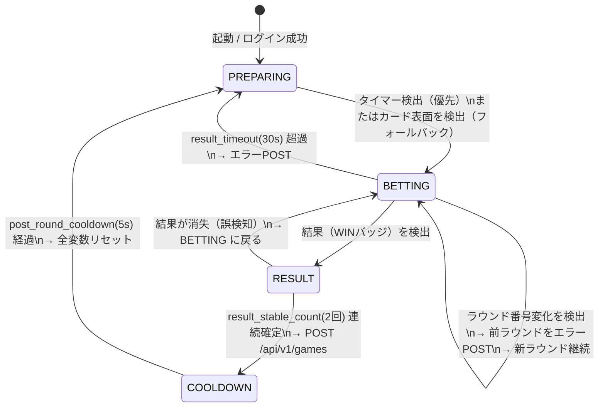
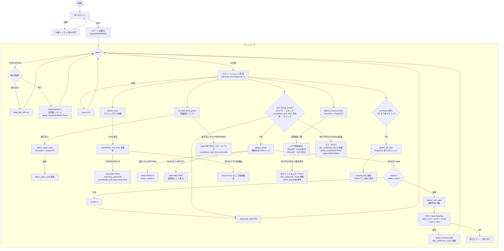
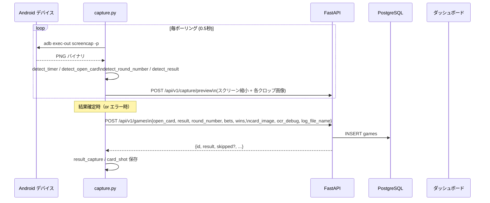

# キャプチャシステム 仕様書

## 概要

ADB でAndroidデバイスのスクリーンショットを定期取得し、OpenCV + OCR で画面を解析して
ゲームデータを自動収集するシステム。収集したデータは REST API 経由でDBに保存される。

---

## ゲームの流れ（1ラウンド約25秒）

```
[オープンカード表示 ~10秒] → [カウントダウン 15秒] → [結果表示 ~3秒] → [次ラウンド]
```

| フェーズ | 画面の状態 | 取得対象 |
|---|---|---|
| オープン | カード裏面（緑）→ 表面に変わる | オープンカード、ラウンド番号、ジャックポット |
| カウントダウン | タイマー 15→0 が動く | ベット額（終了4秒前にスキャン） |
| 結果 | WIN バッジが点灯 | 結果（cowboy/draw/bull）、サブWIN フラグ |
| クールダウン | 次ラウンド開始まで待機 | なし（5秒待機） |

---

## ステートマシン（4状態）



### 各ステートの役割

| ステート | 役割 |
|---|---|
| PREPARING | カード裏面（緑）が表面に変わるのを待つ。タイマーまたはカード検出でBETTINGへ |
| BETTING | ベット受付中・カウントダウン監視。結果が現れるのを待つ |
| RESULT | WINバッジを連続検出してノイズ除去。stable_count 達成でPOST確定 |
| COOLDOWN | POST後の待機。5秒後にPREPARINGへ戻り全変数をリセット |

---

## タイミング設定（config.yml）

| パラメータ | 値 | 説明 |
|---|---|---|
| `post_round_cooldown` | **5s** | POST後のクールダウン。短すぎると結果残像で誤検知、長すぎるとラウンドを見逃す |
| `poll_fast` | 0.5s | BETTING/RESULT 中のポーリング間隔 |
| `poll_idle` | 1s | COOLDOWN 中のポーリング間隔 |
| `result_stable_count` | 2 | 結果確定に必要な連続検出回数 |
| `result_check_delay` | **15s** | BETTING開始からWINバッジチェックを始めるまでの待機秒数（タイマーOCR失敗時のフォールバック） |
| `result_timeout` | **30s** | BETTINGタイムアウト。超過したらエラーPOSTしてPREPARINGに戻る |

> **ギャップの計算例**: POST後のギャップ = COOLDOWN(5s) + PREPARING(緑カード待ち~8s) + BETTING(最大30s) = 最大43s ≒ 1.5ラウンド分

---

## メインループ フローチャート



---

## 検出メソッド一覧

### detect_timer（Tesseract OCR）

| 項目 | 内容 |
|---|---|
| 手法 | Tesseract OCR（`\d+s` パターン抽出） |
| 対象 | カウントダウン表示（0〜15秒） |
| 出力 | 整数（残り秒数）または `None` |
| 用途 | BETTING 移行トリガー（優先）・`countdown_end_time` 補正 |

> タイマー検出が主な BETTING 移行トリガー。失敗時はカード表面検出でフォールバック。

### detect_open_card（Tesseract + EasyOCR）

| 項目 | 内容 |
|---|---|
| 手法 | Tesseract（whitelist: AKQJ0-9）+ EasyOCR フォールバック |
| 前処理 | scale(4)倍拡大 → Otsu二値化 / 固定閾値 マルチトライ |
| 出力形式 | `"AH"`, `"KS"`, `"10D"` など（ランク+スート） |
| スート判定 | 色判定（赤 → H/D）+ 輪郭形状マッチング（matchShapes + IoU） |
| 緑チェック | HSV緑マスク比率 > 0.45 で裏面とみなしスキップ |

### detect_round_number（Tesseract + EasyOCR）

| 項目 | 内容 |
|---|---|
| 手法 | Tesseract V-mask法 → グレースケール法 → EasyOCR+CLAHE の順でフォールバック |
| 出力形式 | 整数（6桁のラウンド番号）|
| 取得タイミング | **RESULT 以外** のフェーズで継続取得（結果画面ではラウンド番号が非表示の場合あり） |
| 確定条件 | **2回連続で同一値**を検出した場合のみ採用 |

#### OCR 誤読補正ロジック

ラウンド番号の急激な変化（OCR誤読）を自動補正する。

| 条件 | 許容ジャンプ幅 | 補正値 |
|---|---|---|
| 前回確定から **28秒以内** | +1 のみ | `last_confirmed_round + 1` |
| 前回確定から 28〜60秒 | +3 まで | `last_confirmed_round + 1` |
| 前回確定から 60秒超 / 未確定 | 補正なし | OCR値をそのまま使用 |

> **`last_confirmed_round`** は正常・エラーいずれの POST 後にも更新される。
> エラー POST 後も更新することで、エラー連鎖中も補正が有効になる。

### detect_result（輝度判定）

| 項目 | 内容 |
|---|---|
| 手法 | HSV V>220 かつ S>70 のピクセル比率で WIN バッジを判定 |
| 領域分割 | 結果ボタン行を3等分（左=cowboy, 中=draw, 右=bull） |
| 閾値 | max_score ≥ 0.25 かつ 2位との差 ≥ 0.06 |
| 出力 | `"cowboy"` / `"draw"` / `"bull"` / `None`（未検出） |

### detect_sub_wins（輝度判定）

| 項目 | 内容 |
|---|---|
| 手法 | 各サブポジション領域の輝度比率 |
| 対象 | any_flash / any_pair / any_ace / win_high / win_two / win_sf / win_fh / win_four |
| 閾値 | V > 220 の比率 ≥ 0.30 で WIN |

### detect_all_bets（EasyOCR）

| 項目 | 内容 |
|---|---|
| 手法 | EasyOCR（英語）で各ポジションのラベル数値を読み取る |
| 対象 | 全11ポジション（cowboy/draw/bull + 8サブ） |
| 数値形式 | `"5.5K"` → 5500, `"1.3K"` → 1300 |
| OCR誤字補正 | S→5, O→0, l→1, I→1 |
| **取得タイミング** | `countdown_end_time` まで **残り4秒以下** で1回だけスキャン（WINアニメーション前に取得） |

---

## エラー処理

### BETTING タイムアウト（result_timeout: 30s）

結果を `result_timeout` 秒以内に検出できなかった場合：
1. エラーPOST（`result: "error"`, `round_number`, `open_card` を含む）
2. `last_confirmed_round` / `last_confirmed_time` を更新
3. `latest_round_number = None`, `latest_open_card = None` をリセット
4. PREPARING へ戻る（COOLDOWN なし）

### BETTING 中のラウンド番号変化

BETTING 中に OCR がラウンド番号の変化を検出した場合（= 前ラウンドの結果を見逃した）：
1. `latest_round_number == last_confirmed_round` なら **スキップ**（重複POST防止）
2. 前ラウンドをエラーPOST
3. `last_confirmed_round` / `last_confirmed_time` を更新
4. `latest_open_card`, `cached_bets` などをリセット
5. BETTING を新ラウンドとして継続

### RESULT フェーズ中のタイマー誤検知

結果表示中にタイマーが **2回連続で検出**された場合、OCR 誤読と判定して `result = "error"` として強制確定する。

### エラーPOST 重複防止

同一ラウンド番号のエラーPOST が連続して発生しないよう、  
`latest_round_number == last_confirmed_round` チェックをガードとして設けている。

---

## ログシステム

### ラウンドログ（`/app/logs/{round_number}.log`）

- POST 確定時（正常・エラーいずれも）にそのラウンドの全ログを保存
- ファイル名: `{round_number}.log`（ラウンド番号不明の場合 `error_{timestamp}.log`）
- 最大100件保持（古いものから削除）

### キャプチャ画像

| 種別 | 保存先 | 内容 |
|---|---|---|
| 結果キャプチャ | `/app/logs/result_captures/{game_id}.jpg` | 結果確定時の全画面（1/2縮小） |
| カード画像 | `capture/card_shots/{game_id}_{card}.jpg` | オープンカード領域（4倍拡大） |

---

## データフロー



---

## クロップ座標（1080x2460 端末基準）

```yaml
open_card_crop:      [743, 805, 303, 337]   # オープンカード全体（裏面チェック・保存用）
open_card_rank_crop: [745, 780, 303, 337]   # ランク認識エリア
open_card_suit_crop: [780, 805, 303, 337]   # スート認識エリア
timer_crop:          [745, 804, 522, 618]   # カウントダウンタイマー
round_crop:          [690, 722, 555, 661]   # ラウンド番号テキスト
jackpot_stock_crop:  [935, 970, 400, 680]   # ジャックポットストック
result_crop:         [1100, 1300, 30, 1050] # 結果ボタン行（3等分で判定）
winning_hand_rows:   3行×[y0,y1,x0,x1]     # 勝利ハンド（手1〜3）
```

---

## 既知の問題と対応状況

| 問題 | 原因 | 状態 |
|---|---|---|
| ラウンド番号OCR誤読（+2ジャンプ等） | Tesseract の誤認識 | **対応済**: 28秒以内は +1 のみ許容、エラー後も補正継続 |
| 同一ラウンド番号のエラー二重POST | タイムアウト後に再BETTINGして補正値が誤発火 | **対応済**: 重複ガード + タイムアウト後のリセット追加 |
| RESULT フェーズ中のタイマー誤検知 | 結果画面でタイマー領域にノイズ | **対応済**: 2回連続検出で `error` 強制確定 |
| オープンカードの誤読 | Tesseract の精度限界 | EasyOCR フォールバック追加済み |
| サブWIN 誤判定 | クロップ座標・輝度閾値が実機とズレ | 要キャリブレーション（`--debug` で確認） |

---

## デバッグ・チューニング方法

### 方法1: ラウンド番号OCR専用チューニングツール（推奨）

```bash
docker exec cowboy-capture-1 python3 capture/tune_round_ocr.py
```

**操作キー:**
| キー | 機能 |
|---|---|
| 0-7 | OCRプリセット切り替え（精度比較） |
| w/W | y0を±5減/増 |
| i/I | y1を±5減/増 |
| a/A | x0を±5減/増 |
| j/J | x1を±5減/増 |
| p | 現在の座標を表示 |
| n | 新規スクリーンショット取得 |
| s | 現在の座標をconfig.ymlに保存 |
| q | 終了 |

### 方法2: キャプチャの直接デバッグ

```bash
docker exec cowboy-capture-1 python3 capture/capture.py --once --debug

# デバッグ画像の保存先
/tmp/cowboy_round_region.png   # ラウンド番号領域
/tmp/cowboy_round_inv.png      # 二値化後
/tmp/cowboy_suit_region.png    # スート領域
/tmp/cowboy_result_region.png  # 結果ボタン行
/tmp/cowboy_timer_region.png   # タイマー領域
```

### ログ確認

```bash
# 最新のラウンドログを確認
docker exec cowboy-capture-1 ls -lt /app/logs/*.log | head -10

# 特定ラウンドのログ
docker exec cowboy-capture-1 cat /app/logs/243317.log
```
