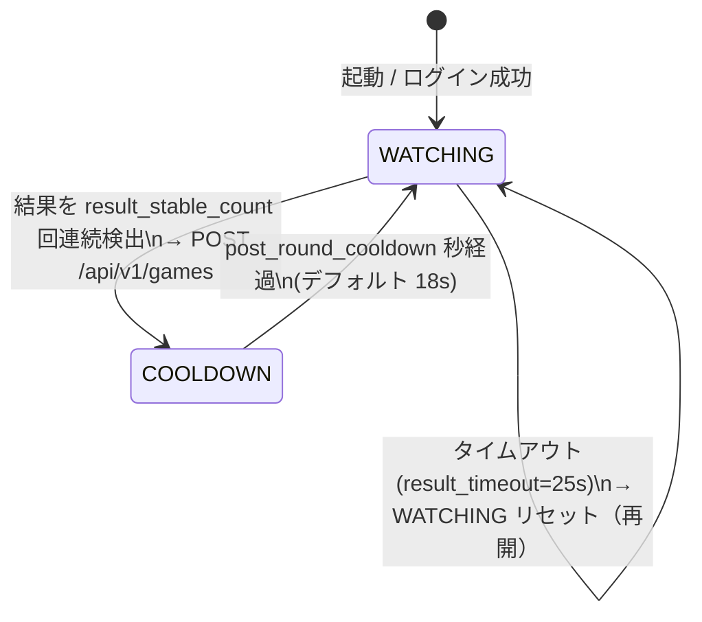
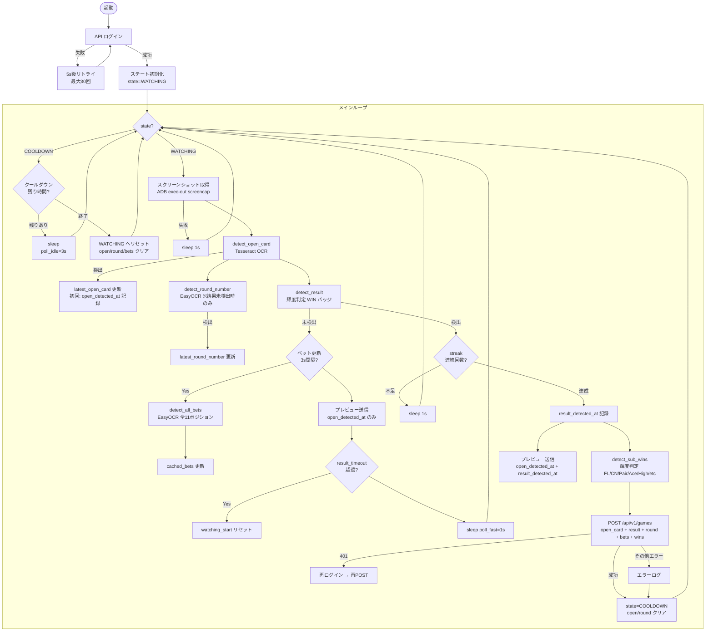
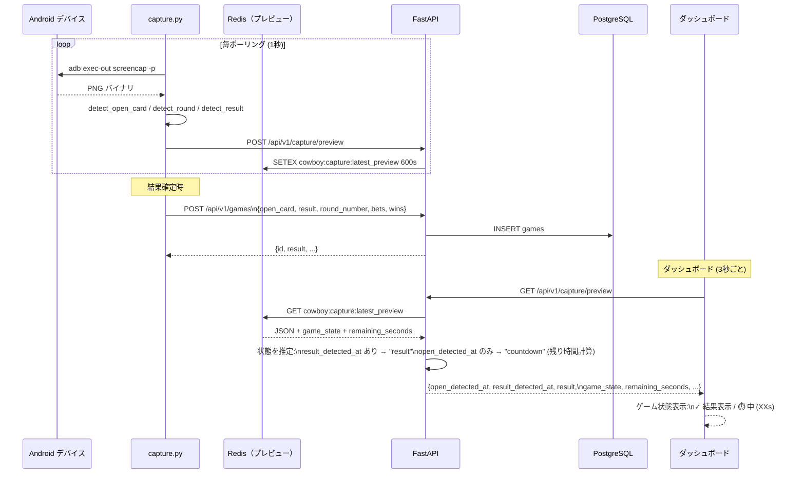

# キャプチャシステム 仕様書

## 概要

ADB でAndroidデバイスのスクリーンショットを定期取得し、OpenCV + OCR で画面を解析して
ゲームデータを自動収集するシステム。収集したデータは REST API 経由でDBに保存される。

---

## ゲームの流れ（1ラウンド約25秒）

```
[オープンカード表示 ~10秒] → [カウントダウン 15秒] → [結果表示 ~3秒] → [次ラウンド]
```

| フェーズ | 画面の状態 | 取得対象 |
|---|---|---|
| オープン | 1枚のカードが表示される | オープンカード、ラウンド番号、ベット額 |
| カウントダウン | 15→0 のタイマーが動く | ベット額（継続更新） |
| 結果 | WIN バッジが点灯 | 結果（cowboy/draw/bull）、サブWIN |
| クールダウン | 次ラウンド開始まで待機 | なし |

---

## ステートマシン



---

## メインループ フローチャート



---

## 検出メソッド一覧

### detect_open_card（Tesseract OCR）

| 項目 | 内容 |
|---|---|
| 手法 | Tesseract OCR（whitelist指定） |
| 前処理 | scale倍拡大 → グレースケール → Otsu二値化 |
| 出力形式 | `"AH"`, `"KS"`, `"10D"` など（ランク+スート） |
| スート補完 | OCRで取れなければ赤色比率で H/S を推定 |
| 問題点 | 小さいカード画像ではOCR精度が低い |

### detect_round_number（EasyOCR）

| 項目 | 内容 |
|---|---|
| 手法 | EasyOCR（英語モデル） |
| 前処理 | 2倍拡大 |
| 出力形式 | 整数（ラウンド番号） |
| 取得タイミング | **結果未検出フェーズ**（オープン〜カウントダウン中）に継続取得・キャッシュ |
| 問題点 | EasyOCR未インストール時は常に None |

> **重要**: ラウンド番号は結果画面では表示されない可能性があるため、
> オープンカード表示〜カウントダウン中に取得しキャッシュする。

### detect_result（輝度判定）

| 項目 | 内容 |
|---|---|
| 手法 | HSV V チャンネル > 220 のピクセル比率で WIN バッジを判定 |
| 領域分割 | 結果ボタン行を3等分（左=cowboy, 中=draw, 右=bull） |
| 閾値 | max_score ≥ 0.30 で結果あり |
| 出力 | `"cowboy"` / `"draw"` / `"bull"` / `None`（未検出） |

### detect_sub_wins（輝度判定）

| 項目 | 内容 |
|---|---|
| 手法 | 各サブポジション領域の輝度比率 |
| 対象 | FL(any_flash), ペア(any_pair), A(any_ace), High, Two, SF, FH, Four |
| 閾値 | V > 220 の比率 ≥ 0.30 で WIN |
| 問題点 | クロップ座標が実機と合っていないと誤判定 |

### detect_all_bets（EasyOCR）

| 項目 | 内容 |
|---|---|
| 手法 | EasyOCR（英語）で各ポジションのラベル数値を読み取る |
| 対象 | 全11ポジション（cowboy/draw/bull + 8サブ） |
| 数値形式 | `"5.5K"` → 5500, `"1.3K"` → 1300 |
| OCR誤字補正 | S→5, O→0, l→1, I→1 |
| 取得タイミング | 結果未検出中・3秒間隔でキャッシュ更新 |

---

## データフロー



### ゲーム状態判定

判定は **WIN（result）バッジの有無** を基準とする。WIN がどこにも出ていなければ「投票中」。

| game_state | 条件 | remaining_seconds | 表示 |
|---|---|---|---|
| result | `result` が存在（WINバッジ検出） | なし | ✓ 結果表示 |
| betting | `result` が None（WIN無し）| 25秒 - オープン検出からの経過 | 🗳️ 投票中 (残りXXs) |
| unknown | result も open_detected_at も無い | なし | 待機中 |

### ライブ判定範囲プレビュー

ダッシュボードのライブキャプチャに、OCR が判定に使っている**クロップ範囲を拡大画像**で表示する。
クロップ座標のズレや OCR 誤読をブラウザ上でリアルタイムに目視確認できる。

| プレビュー項目 | ペイロードフィールド | 用途 |
|---|---|---|
| ラウンド判定範囲 | `round_image` | `round_crop` を3倍拡大した画像 + OCR結果 |
| オープンカード判定範囲 | `open_card_image` | `open_card_crop` を3倍拡大した画像 + OCR結果 |

> クロップが合っていない／OCRが誤読している場合は、表示画像を見て
> `config.yml` の `round_crop` / `open_card_crop` を調整する。
> 数字の細かい誤読（例: 6→0）は `tune_round_ocr.py` でプリセットを比較してチューニングする。

---

## クロップ座標（1080x2460 端末基準）

```
画面座標系: [y_start, y_end, x_start, x_end]
現行値: open_card_crop=[710,800,195,350]  round_crop=[698,732,555,785]

                x=0       x=195 x=350   x=555      x=785   x=1080
                |          |     |       |          |        |
y=698           +----------+-----+-------+----------+--------+
                |          |open |       |round_crop|        |
y=732           |          |card |       +----------+        |
y=800           |          |crop |                           |
                +----------+-----+---------------------------+
y=1100          |                                           |
                |        result_crop (WIN バッジ行)          |
y=1260          |                                           |
                +-------------------------------------------+
y=1300          |                                           |
                |        winning_hand_rows (手1〜3)          |
y=1800          |                                           |
                +-------------------------------------------+
y=1335          |         |             |                   |
                |any_flash|  win_high   |    win_two        |
y=1545          |         |             |                   |
y=1545          |any_pair |  win_sf     |    win_fh         |
y=1745          |         |             |                   |
y=1745          |any_ace  |             win_four            |
y=1960          |         |                                 |
                +---------+---------------------------------+
```

---

## 既知の問題と対応状況

| 問題 | 原因 | 状態 |
|---|---|---|
| ラウンド番号が取れない | 結果画面でラウンドが非表示 + クロップ座標のズレ | **対応済**: オープンフェーズ中に継続取得するよう変更 |
| オープンカードの誤読 | Tesseract の精度限界 | EasyOCR フォールバック追加済み |
| FL/CN Win の誤判定 | クロップ座標・輝度閾値が実機と合っていない | 要キャリブレーション（`--debug` で確認） |
| ラウンドがユニークキー化できない | 精度不足 | 取得精度向上後に再検討 |

---

## デバッグ・チューニング方法

### 方法1: ラウンド番号OCR専用チューニングツール（推奨）

```bash
cd capture
docker exec cowboy-capture-1 python3 tune_round_ocr.py
```

**操作キー:**
| キー | 機能 |
|---|---|
| 0-7 | OCRプリセット切り替え（精度比較） |
| w/W | y0を±5減/増 |
| i/I | y1を±5減/増 |
| a/A | x0を±5減/増 |
| j/J | x1を±5減/増 |
| p | 現在の座標を表示 |
| n | 新規スクリーンショット取得 |
| s | 現在の座標をconfig.ymlに保存 |
| q | 終了 |

**プリセット:**
0. EasyOCR (CLAHE 強調) ← **推奨**（精度が高い）
1-3. Tesseract (反転 psm=7/8/13)
4. Tesseract (whitelist なし)
5. EasyOCR (前処理なし)
6. Tesseract (元画像 psm=7)
7. 適応的閾値

出力ファイル:
- `/tmp/round_ocr_crop.png` — 現在のクロップ領域
- `/tmp/round_ocr_new.png` — 新規取得時のクロップ

### 方法2: 統合デバッグビュー

```bash
docker exec cowboy-capture-1 python3 debug_view.py --out /tmp/cowboy_debug.png
docker cp cowboy-capture-1:/tmp/cowboy_debug.png ./debug.png
```

各領域を色分けして描画。OCR結果をオーバーレイ表示。

### 方法3: キャプチャの直接デバッグ

```bash
python3 capture/capture.py --once --debug

# 保存される画像
/tmp/cowboy_open_card.png          # オープンカード切り取り
/tmp/cowboy_round_region.png       # ラウンド番号領域
/tmp/cowboy_result_region.png      # 結果ボタン行
```
